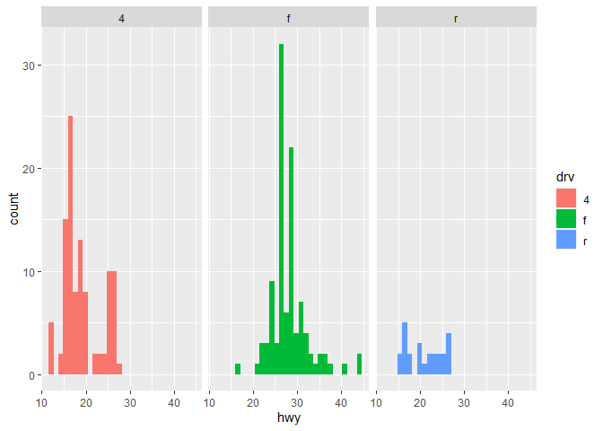
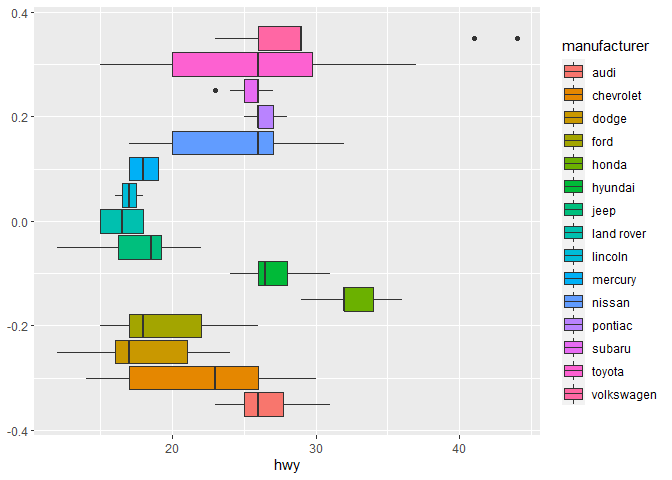

Programming in R
================
John Hinic
2022-07-02

## R Programming Reflections

Well, the summer session only has about 1 month left at this point,
which feels kind of insane. Regardless, at this point we are done
formally learning about “how to program” in R. I think that, for the
most part, most of the material would be considered review for me - some
areas I absolutely needed the review, while others served more as
helpful practice. There were also some topics that we went a good bit
deeper than what I knew coming into the class.

One example would be pretty much the whole concept of “functional
programming.” I’ve learned about writing functions and their benefits
before, and even use little helper functions a fair amount (my job also
uses SAS, and I use macros quite a bit for that). But I feel like I’ve
started to scratch the surface of *real* functional programming, which
is really exciting and cool on the one hand, but also pretty
overwhelming on the other.

When considering the things I am most and least prepared for in
industry, I think the process of actually putting a model into
production is one of the big ones I will need to learn more about. From
what I understand, one part of this (from a data scientist’s
perspective) is essentially just wrapping everything up in functions and
putting them in scripts, so it’s been really cool learning more about
functions in general.

### Example

The general rule of thumb is that if you ever write the same code more
than twice, you should put it into a function instead. One time I find
myself needing to copy paste similar code a lot is when I’m performing
some EDA and want to make a bunch of plots with different groupings or
different aesthetics. So, to demonstrate the usefulness of writing
functions to perform these repetitive tasks, I’m going to write a
function that allows me to create a range of plots using `ggplot2` and
the `mpg` dataset.

Before starting, we’ll load in the `tidyverse` library and show the data
we’ll be using.

``` r
library(tidyverse)
head(mpg)
```

    ## # A tibble: 6 x 11
    ##   manufacturer model displ  year   cyl trans      drv     cty   hwy fl    class
    ##   <chr>        <chr> <dbl> <int> <int> <chr>      <chr> <int> <int> <chr> <chr>
    ## 1 audi         a4      1.8  1999     4 auto(l5)   f        18    29 p     comp~
    ## 2 audi         a4      1.8  1999     4 manual(m5) f        21    29 p     comp~
    ## 3 audi         a4      2    2008     4 manual(m6) f        20    31 p     comp~
    ## 4 audi         a4      2    2008     4 auto(av)   f        21    30 p     comp~
    ## 5 audi         a4      2.8  1999     6 auto(l5)   f        16    26 p     comp~
    ## 6 audi         a4      2.8  1999     6 manual(m5) f        18    26 p     comp~

For the sake of this demonstration, let’s assume the only numeric
variable we are interested in is `hwy`, and we want to make both box
plots and histograms of that variable. We’ll write a function that takes
in the type of plot we want (“box” or “hist”), if/how we want to group
it (only one level of grouping), and how we want to display the groups
(“color”, “facet”, or “both”).

``` r
plotting <- function(type, grp = NULL, grpDisp = "facet") {
  plotfun <- switch(
    type,
    "box" = geom_boxplot,
    "hist" = geom_histogram,
    stop("Invalid plot type supplied")
  )
  if(!is.null(grp)){
    if(grpDisp %in% c("color", "both")) aesOpt <- paste0(", fill = ", grp)
    else aesOpt <- ""
    
    if(grpDisp %in% c("facet", "both")) facet <- paste0('+ facet_wrap(~', grp, ')')
    else facet <- ""
  } else {
      aesOpt <- ""
      facet <- ""
  }
  
  funcStr <- paste0('mpg %>% ', paste0('ggplot(aes(', paste0('hwy', aesOpt), ')) + plotfun()', facet))
  funcCall <- str2expression(funcStr)
  eval(funcCall)
}
```

Now, we can call this single function with only a few arguments to
create plots instead of writing several lines for each one. For example:

``` r
plotting("hist")
```

    ## `stat_bin()` using `bins = 30`. Pick better value with `binwidth`.

<!-- -->

``` r
plotting("hist", grp = "drv")
```

    ## `stat_bin()` using `bins = 30`. Pick better value with `binwidth`.

<!-- -->

``` r
plotting("hist", grp = "drv", grpDisp = "both")
```

    ## `stat_bin()` using `bins = 30`. Pick better value with `binwidth`.

<!-- -->

``` r
plotting("box", grp = "manufacturer", grpDisp = "color")
```

<!-- -->

``` r
plotting("box", grp = "trans", grpDisp = "both")
```

<!-- -->

This can speed up our workflow quite a bit as long as we have a solid
understanding of how to write the functions in a reasonable time-frame.
