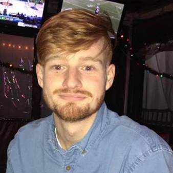

## What is this place?

This blog is mainly going to be about my journey into the data science world through ST 558. Some examples of things I might talk about:
- useful packages
- interesting methodologies
- personal thoughts on the world of data science

## A little about me

I completed my undergrad in statistics in May 2021, and decided to go straight into my masters, at NC State for both. As of now, I'm only about **2.5 months** away from graduating and being done with school _forever_ (which feels pretty surreal).

As of now, I definitely fall more on the "statistics" side of thing (which isn't surprising, given that both of my degrees are in statistics). But I'm looking forward to learning more about the data science side of things. The field is kind of exploding at the moment, so I'm sure _someone_ will be able to take _something_ from my experience - or at least, I hope.

Anyway, here is a picture of me, just to help you put a face to the voice (or text, I suppose):

